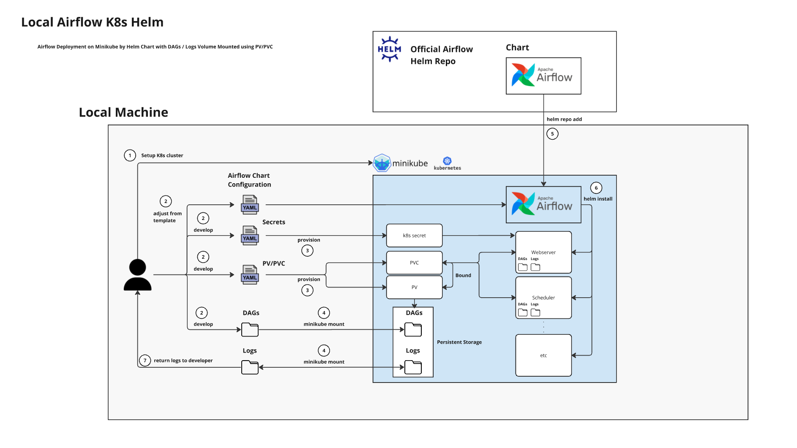

# Local Airflow K8s Helm

*Patcharanat P.*

## Introduction

In this project, we will deploy airflow on Kubernetes (k8s) locally using minikube and helm chart provided officially by Airflow. Moreover, we will make our dags, which can be developed locally on your computer, available on the deployed airflow scheduler and webserver in real-time by volume mount.

### What we are gonna do

Actually, you might find some relevent topics like this on internet but not with the same requirement as this project, such as
- Deploying Airflow on k8s locally from scratch
- Deploying Airflow on k8s locally using minikube, and helm chart
- Deploying Airflow on k8s locally using kind, helm chart, and sync dag with git-sync

But here, we will **deploy Airflow on k8s locally using minikube, helm chart, and sync dag with volume mount.**

I think this is the most easiest way to get used to k8s and starting point of airflow deployment with best pratices.

### Why we are gonna do

What surprised me was that this topic could offer Data Engineers a good introduction to the Data Platform aspect, but it was merely able to find this information with proper explanation and clarified steps. There were scattered pieces of information unconnected and required a lot of adjustment to make the thing happen, so I decided to write this for my future self and someone who also wants such information.

*Don't worry if you are not familiar with kubernetes (k8s), this documentation will not dive into architecture aspect also.*

*Enough talking, let's do it.*

## Pre-requisites
1. Docker installed
2. Minikube installed
3. Helm installed

For me, I used Windows Subsystem for Linux (WSL). Anything beyond this, you have to adjust your configuration yourself.

## Getting Started

### Initialization
```bash
# tools/setup-k8s.sh

# 1. Start k8s cluster locally
minikube start

# 2. Create specific namespace for Airflow deployment
kubectl create namespace airflow

# 3. Add helm repo for airflow deployment template
helm repo add apache-airflow https://airflow.apache.org

# Update repo if necessary
helm repo update

# 4. Create secrets for consistent webserver pods
kubectl apply -f k8s/airflow/secrets

# 5. Create PV/PVC for dags and logs
kubectl apply -f k8s/airflow/volumes

# 6. Mount Airflow components to minikube cluster
minikube mount ~/Desktop/<USER>/<PATH_TO_AIRFLOW_FOLDER>/airflow:/mnt/airflow

# 7. Install airflow with helm
helm upgrade \
    --install airflow apache-airflow/airflow \
    --version 1.15.0 \
    --namespace airflow \
    --values ./k8s/airflow/custom-values.yaml \
    --timeout 10m0s \
    --debug

# 8. Expose port airflow webserver
kubectl port-forward svc/airflow-webserver 8080:8080 -n airflow

# Go to http://localhost:8080
```



### Explanation

1. Start k8s cluster locally
    - Instead to use k8s cluster on cloud services, minikube allow us to test airflow deployment locally with minimal configuration and no cost.
2. Create specific namespace for Airflow deployment
    - You can either install airflow in 'default' namespace or a custom one. But in my opinion, utilzing namespace is a better practice to make data mesh available for scalability.
3. Add helm repo for airflow deployment template
    - Helm repo is global for a cluster. You can pull 'Chart' *(a set of template files)* to easily install services that you need without DIY.
4. Create secrets for consistent webserver pods
    - After first installation by airflow-helm, you will see warning telling that you should set webserver secret key which is crucial for webserver stability. Without a proper setting up, airflow webserver pod is potential to keep restarting and unstable between Web UI sessions.
    - There's multiple ways to config webserver secret key suggested by community or official airflow production guide. The one used in this project is one of them.
    - You can create secret by `kubectl` applying configuration file with secret kind: [airflow-secret.yaml](./k8s/airflow/secrets/airflow-secret.yaml)
5. Create PV/PVC for dags and logs
    - Just like mounting volume in docker compose, k8s works in the same pattern but with different architecture and components by using "persistent volume" (PV) and "persistent volume claim" (PVC).
    - **What important** in this pair configuration are `metadata.name`, `metadata.name`, `spec.*` must be associated between PV and PVC. And `spec.hostPath.path` in PV is referred to path in minikube cluster's directory, not directory in your local computer. So, if we want to mount "dags" and "logs" volume we need:
        - PV and PVC for dags folder
        - PV and PVC for logs folder
    - PV for both dags and logs is in [persistent-volume.yaml](./k8s/airflow/volumes/persistent-volume.yaml) and PVC for both is in [persistent-volume-claim.yaml](./k8s/airflow/volumes/persistent-volume-claim.yaml)
6. Mount Airflow components to minikube cluster
    - After we create volume between Airflow components and minikube cluster, we need to mount dags folder and logs folder from our local computer to minikube cluster to make our folder on local computer available in airflow components' container, just like enabling a tunnel for real-time reading and writing.
    - We need to keep mounting session alive while developing dags, so I recommend to execute the command in another terminal session.
    - You can adjust path to match your use case from `<local-computer-path>:<target-path-in-minikube>`
7. Install airflow with helm
    - There's multiple flags to mention here
        - `--install` refer to "release name" to be created from "specified helm repo"
        - `--version` refer to release version in repo, not airflow version.
        - `--namespace` refer to namespace in the k8s cluster to deploy release.
        - `--values` or `-f` refer to a file to be applied in installation
            - You can customize airflow configuration in this file such as airflow version, executor, components' resource, **dags and logs persistence**, etc. You can check in [custom-values.yaml](./k8s/airflow/custom-values.yaml)
            - We have to refer to template provided from official airflow chart for reference, so we can correctly override default configuration.
        - `--timeout` refer to maximum time to wait for installation.
        - `--debug` to enabling verbose.
8. Expose port airflow webserver
    - Forward port to allow us access to Web UI

### Termination
```bash
# tools/cleanup-k8s.sh

# This can be omitted, if you intend to delete k8s cluster eventually
helm uninstall airflow -n airflow

# Stop k8s cluster
minikube stop

# Delete minikube container
minikube delete --all

# Don't forget to remove pulled image in Docker
```

## Troubleshoot

1. Unable to resolve the current Docker CLI context "default": context "default": context not found: on Windows
    ```bash
    docker context use default
    ```
2. Sometimes, it fails to install airflow from helm chart. We need to uninstall incompleted release and increase `--timeout` flag and re-install again.
3. If minikube node is freezed or fail to continue,
    - `minikube stop` and delete container manually in docker desktop
    - `minikube delete --all`
    - Increase minikube resources limit (try memory 8GB). You may want to increase docker resource allocation limits on Windows, see more information in 4.kubernetes topic in [References](#references) section.
4. If any airflow pods keep restarting
    - Setting webserver secret key is the first step to try before other ways.
    - Either Connection refused after forwarding port or unhealthy from healthcheck, you should try to increase minikube resources limit (try memory 8GB) (Not airflow components resource).
    - But if increasing minikube resources limit is not worked, try increasing airflow webserver resources' limits.


## References
1. Airflow Helm Chart
    - [Official Apache Airflow Helm Chart Documentation - Airflow Production Guide](https://airflow.apache.org/docs/helm-chart/stable/production-guide.html)
        - [Official airflow helm chart values.yaml for reference - Airflow Helm Chart GitHub](https://github.com/apache/airflow/blob/main/chart/values.yaml)
    - [User Community Documentation & Tutorials](https://github.com/airflow-helm/charts/tree/main/charts/airflow)
        - [Minikube Values.yaml Template](https://github.com/airflow-helm/charts/blob/main/charts/airflow/examples/minikube/custom-values.yaml)
        - [GKE Values.yaml Template](https://github.com/airflow-helm/charts/blob/main/charts/airflow/examples/google-gke/custom-values.yaml)
2. Official Airflow
    - [Setting webserver secret keys with best practices - Airflow Production Guide](https://airflow.apache.org/docs/helm-chart/stable/production-guide.html#webserver-secret-key)
        - [How to Kubernetes Secrets - Spacelift](https://spacelift.io/blog/kubernetes-secrets)
3. Airflow PV/PVC dags/logs for local development
    - [Airflow on K8s for local Development - Yoav Nordmann - Medium](https://medium.com/israeli-tech-radar/airflow-on-k8s-for-local-development-5c3ad0ab8e7d) *(This did not work, but it initially provided a good approach. I have to adjust configuration additionally)*
    - [Mounting to minikube and how to use `hostPath` - Stackoverflow](https://stackoverflow.com/a/69225057)
4. Kubernetes
    - [Kubernetes cluster's status is not ready - describing nodes - Stack Overflow](https://stackoverflow.com/questions/47107117/how-to-debug-when-kubernetes-nodes-are-in-not-ready-state)
    - [Customize Memory limits for Docker and led to Kubernetes on local machine - wslconfig - Microsoft Learn](https://learn.microsoft.com/en-us/windows/wsl/wsl-config#configure-global-options-with-wslconfig)
    - [Set minikube resource allocation limits](https://stackoverflow.com/questions/52199737/minikube-default-cpu-memory)